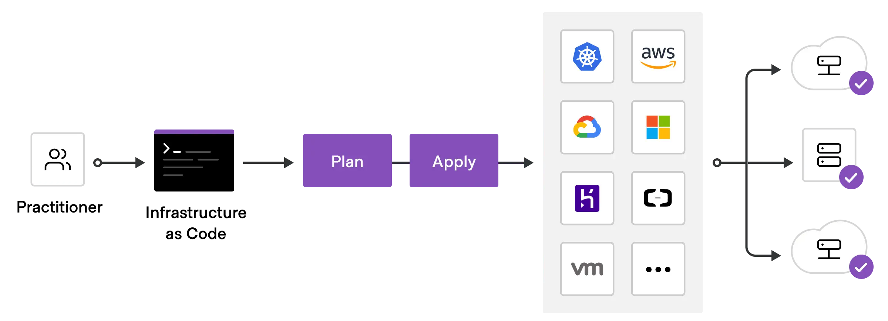

# Getting started with Terraform

  

- So, you've decided to give Terraform a try. Great! This guide will help you get started with Terraform and create your first infrastructure.
- Terraform is an open-source infrastructure as code software tool created by HashiCorp. It allows users to define and provision data center infrastructure using a declarative configuration language.
- So, let's first start by checking if Terraform is installed on your system. You can do this by running the following command in your terminal:

    ```bash
    terraform validate
    ```

- If not follow the instructions mentioned here at <a href="https://developer.hashicorp.com/terraform/install">Terraform</a>.

- Once, the installation is done make sure it's been added to the PATH, check it using the command:

    ```bash
    which terraform
    ```

  The command mentioned here are specifically for mac users only.

## What is Infrastructure as Code

  

  >[!IMPORTANT]  
  >Infrastructure as Code (IaC) is the managing and provisioning of infrastructure through code instead of through manual processes.

 Infrastructure as Code is essentially a hub that can be used for collaboration across the IT organization to improve infrastructure deployments, increase our ability to scale quickly, and improve the application development process. Infrastructure as Code allows us to do all this consistently and proficiently. By using Infrastructure as Code for both our on-premises infrastructure and the public cloud, our organization can provide dynamic infrastructure to both our internal team members and ensure our customers have an excellent experience.

  But with the advent of cloud computing, provisioning infrastructure has become easy as most of the complex configurations are abstracted away by the cloud providers using virtualization and software-defined networking (Private and public clouds). You can provision network, servers, and storage in a few minutes.

  And the best part is everything is API driven. All cloud providers expose APIs to interact with their platform to provision infrastructure. If it is API driven, you can use any programing language to manage your IT infrastructure. Not only just provisioning, but you can also configure the provisioned resources using code.

  If you use code to provision and configure the infrastructure, it is called Infrastructure as code (IaC). To put it simply, codifying the infrastructure provisioning and configuration.

  With the concept of Infrastructure as code, you can follow the same workflow you use for application development for Infrastructure as code development. Meaning, versioning the infrastructure code in git, running unit tests, and integration tests, and then deploying it.

## Benefits of IaC

  Following are some of the key benefits of IaC:

- With IaC, you can recreate any complex infrastructure with one click.
  
- You can version control your infrastructure state in the form of IaC.

- Developer-centric workflow in infrastructure management. Like developing applications, a standard practice for IaaC code is to follow all standard coding practices like testing, review, etc. Many companies follow test-driven IAC developed to have foolproof infra-change systems.

- While there are many benefits of Infrastructure as Code, a few key benefits include simplifying cloud adoption, allowing us to adopt cloud-based services and offerings to improve our capabilities quickly.

- We can also use Infrastructure as Code to provide capacity-on-demand by offering a library of services for our developers.

- We can publish a self-service capability where developers and application owners can be empowered to request and provision infrastructure that better matches their requirements.

### IaC Tools

The list below represents some of the most popular Infrastructure as Code tools used by many organizations worldwide. These tools focus on deploying infrastructure on a private or public cloud platform. The list does NOT include tools such as Puppet, Chef, Saltstack, or Ansible since those are commonly placed in the configuration management category and don't really deploy infrastructure resources. There are likely other tools available, but they are not as popular as the ones listed below.

- HashiCorp Terraform - terraform.io
- AWS CloudFormation - aws.amazon.com/cloudformation
- Azure Resource Manager (ARM) - azure.microsoft.com
- Google Cloud Deployment Manager - cloud.google.com/deployment-manager/docs
- Pulumi - pulumi.com

## IaC and the Infrastructure Lifecycle

  

  IaC can be applied throughout the lifecycle, both on the initial build, as well as throughout the life of the infrastructure. Commonly, these are referred to as Day 0 and Day 1 activities. “Day 0” code provisions and configures your initial infrastructure.

  If your infrastructure never changes after the initial build (no OS updates, no patches, no app configurations, etc.) then you may not need tools that support subsequent updates, changes, and expansions. “Day 1” refers to OS and application configurations you apply after you’ve initially built your infrastructure.

  IaC makes it easy to provision and apply infrastructure configurations, saving time. It standardizes workflows across different infrastructure providers (e.g., VMware, AWS, Azure, GCP, etc.) by using a common syntax across all of them.

  IaC makes it easy to understand the intent of infrastructure changes, because it can span multiple files, allowing human operators to organize the code based on the intent.

### IaC makes Infrastructure reliable and manageable

  

- IaC makes changes idempotent, consistent, repeatable, and predictable. Without IaC, scaling up infrastructure to meet increased demand may require an operator to remotely connect to each machine and then manually provision and configure many servers by executing a series of commands/scripts. They might open multiple sessions and move between screens, which often results in skipped steps or slight variations between how work is completed, necessitating rollbacks. Perhaps a command was run incorrectly on one instance and reverted before being re-run correctly.

- These process inconsistencies can result in slight differences between servers that compound over time and could impact their performance, usability, or security. If a large team is applying changes, the risks increase because individuals don’t always follow the same instructions identically.

- With IaC, we can test the code and review the results before the code is applied to our target environments. Should a result not align to our expectations, we iterate on the code until the results pass our tests and align to our expectations. Following this pattern allows for the outcome to be predicted before the code is applied to a production environment. Once ready for use, we can then apply that code via automation, at scale, ensuring consistency and repeatability in how it is applied.

## Fundamentals of Infrastructure:

- **Infrastructure**:

  - Infrastructure refers to the combination of hardware and software components that make up the IT environment, such as servers, storage, network devices, firewall devices, routers, and more.

- **Provisioning**:

  - In IT, provisioning is the process of creating infrastructure and making it available to end users.

- **Configuration**:

  - It is the process of configuring the provisioned IT infrastructure resources. For example, installing and configuring a database on a server or configuring network and firewall settings.

- **Automation**:

  - It is the process of automating infrastructure tasks, such as automating the installation of software packages, setting up users and permissions, or configuring network devices.

- **Orchestration**:

  - Orchestration is the process of coordinating multiple automation tasks. The output from one automation task can be used as input for another, allowing for a more complex and streamlined workflow. For example, to deploy a server, you may first need to provision network resources, and then use the output from that automation (network details) to deploy the server.

## Indempotency

- All the IaC tools follow the concept of idempotency. Meaning, no matter how many times you run the code, if the infrastructure or configuration is already present, it won’t make any change.

<br/>

  ```mermaid
    graph TD
        A[IaC Script Applied Once] --> B[Infrastructure in Desired State]
        A -->|Reapplied| B
        A -->|Reapplied with No Changes| B
        B --> C[Idempotency Ensured: Same Infrastructure State]

        C --> D[No Additional Resources Created]
        C --> E[No Configuration Drift]

  ```

  For example, you created two servers using Terraform. If you re-run the same terraform code again, it won’t make any changes. However, suppose you manually delete one server and re-run the terraform code. In that case, it will create only one manually deleted server and maintain the state of two servers declared by the user in the code.

## What is Infrastructure Provisioning?

- Infrastructure provisioning is the process of provisioning IT infrastructure resources like Virtual Servers, Storage, Networking, Cloud managed services, etc.

  Terraform, Pulumi and Cloudformation are classic examples of infrastructure provisioning tools. It creates networks, servers, managed services, etc. Its primary purpose is to keep the infrastructure in its desired state and reproduce or update it whenever needed.
  
  With infrastructure provisioning tools, you can also trigger configuration management tools. So, for example, you can have Terraform code to create Virtual machines and have logic to run Ansible provisioners on the created Virtual Machines.

## What is Configuration Management?

- Configuration management is the process of configuring provisioned infrastructure resources. For example, configuring a server with required applications or configuring a firewall device.

  The primary goal of configuration management tools is to configure the server. Meaning, if you want to automate the installation and configuration of an application(e.g., Nginx) in a server, we use a tool like Ansible and Chef. It does all the configurations in an idempotent manner.

  Also, these tools help in managing the configuration drift. It ensures all the servers are running in the same configuration mentioned in the ansible-playbook or a chef cookbook. In the case of an agent-based chef/puppet, if someone changes the server config manually, the chef agent brings it back to the desired state, as mentioned in the cookbook.

  All the configuration management tools keep an inventory of the server’s IP address and SSH credentials to connect to the servers. However, in cloud environments where servers are dynamically provisioned, it uses an API-based dynamic inventory to get the server details.

  

## Infrastructure Provisioning Vs Configuration Management

- Infrastructure provisioning and configuration management are two different concepts, but they are often used together to automate the infrastructure deployment and configuration.

>[!IMPORTANT]
>Infrastructure provisioning is the process of creating infrastructure resources like servers, networks, storage, etc., while configuration management is the process of configuring the provisioned infrastructure resources.

- Infrastructure provisioning tools like Terraform, Pulumi, and CloudFormation are used to create infrastructure resources, while configuration management tools like Ansible, Chef, and Puppet are used to configure the provisioned resources.


## Terraform's Purpose

### Terraform Goals

- Unify the view of resources using infrastructure as code
- Support the modern data center (IaaS, PaaS, SaaS)
- Expose a way for individuals and teams to safely and predictably change infrastructure
- Provide a workflow that is technology agnostic
- Manage anything with an API


### Terraform Benefits

- Provides a high-level abstraction of infrastructure (IaC)
- Allows for composition and combination
- Supports parallel management of resources (graph, fast)
- Separates planning from execution (dry-run)

>[!TIP]
>Terraform is going to go out and going to build a dependency graph of all the resources that are included in the configuration file.<br/><br/>
> If we have a bunch of different resources specified in the configuration file, what terraform will do is figure out which one's are not dependent on any other resources and it will start deploying those resources in parallel. This is a huge benefit because it can save a lot of time when deploying resources.

>[!NOTE]
>Terraform allows you to execute a dry-run for your new configuration file against your real-world resources that are deployed in the public cloud, and tell you what's going to change.


<hr/>

## Benifits of Terraform State

- Terraform is going to require state in order to store information about the infrastructure and resources that it's managing. This is going to be stored in a file called `terraform.tfstate`.

>[!IMPORTANT]
>You cannot use Terraform without state. By default `state` is stored locally in the drectory we are going to execute our terraform.<br/><br/> We do have the option to store the state file in a remote backend, so the ability to mange and modify your state is really specially important when we have more than one person that's going to manage these same resources in Terraform.<br/><br/> Terraform will use `state` each time we run `terraform plan apply` or `terraform destroy` to determine what resources are going to be created, updated or destroyed.