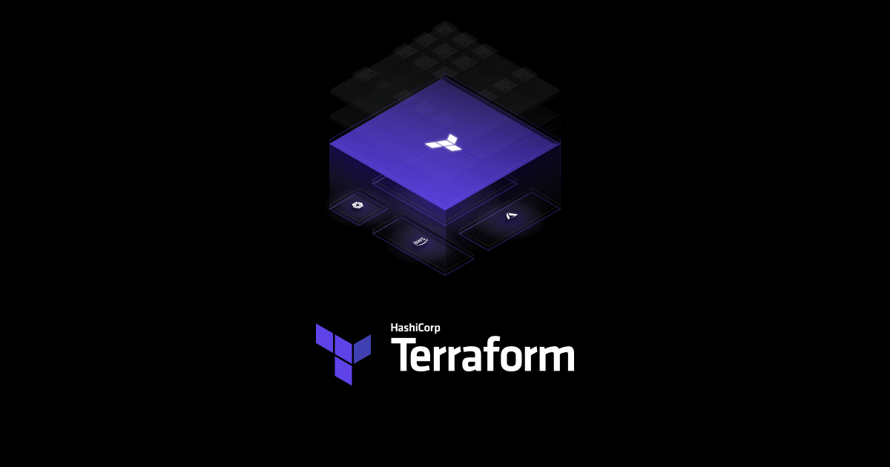

# Understanding Terraform Basics



- All the Terraform interpreters happen in CLI.
- It is a local tool installed on your local machine, and that's where it's going to run.
- The Terraform ecosystem also includes these different providers for cloud services, & also includes the Module Registry.
- We can access the Public Module Registry, which is available to anybody to pull down modules to reuse, Or use a private module registry that comes along with Terraform Cloud or if you're using Terraform Enterprise.

>[!IMPORTANT]
>Basic Terraform Commands:

  ```bash
  >> terraform init
  # Initialize a new or existing Terraform working directory by creating initial files, loading any remote state, downloading modules, etc.
  >> terraform validate
  # Validates the Terraform files
  >> terraform plan
  # Generate and show an execution plan
  >> terraform apply
  # Builds or changes infrastructure
  >> terraform destroy
  # Destroy Terraform-managed infrastructure
  ```

- `terraform init` is the first command that we will run anytime we write a new configuration file or after we clone a existing configuration file from a repository.

  It will initialise the working directory, and it can be run many times in the directory as it never touches our state file nor our configuration file.

  Beyond just initialization, it also downloads the required plugins that are required for the configuration file that we're working with.

- `terraform validate` is going to validate the configuration files in the directory, referring to the syntax of the configuration files.

  It's going to run checks and validate if our configuration file is syntactically correct and is internally consistent.

  It's primarily used for general verification of modules on the configuration files including the correctness of attribute names, the types of values, and the presence of required values.

  But `terraform validate` does not catch all errors, and it's not going to catch errors that require the provider to be available.

- `terraform plan` is going to generate an execution plan, which is a preview of the changes that Terraform is going to make to the infrastructure.

  It will read our current state file, assuming one exists, and will make sure that terraform state is up to date.

- `terraform apply` is going to apply the changes required to reach the desired state of the configuration. It will execute all those actions that were proposed in terraform plan.

  It will apply the changes required to reach the desired state of the configuration, or the pre-determined state that we have defined in our configuration file.

  It will apply the changes required to reach the desired state of the configuration, or the pre-determined state that we have defined in our configuration file.

- `terraform destroy` is going to destroy the Terraform-managed infrastructure, and the resources that it knows about from the state file.

<hr> 

# Practice Lab

- Create a new directory and navigate to it.

  ```bash
  >> mkdir lab-1
  >> cd lab-1
  ```

- Create a new file named `main.tf` and add the following code to it.

  ```hcl
  resource "random_string" "str" {
    length = 16
  }
  ```

- Run the following commands to initialize the working directory, validate the configuration file, and generate an execution plan.

  ```bash
  >> terraform init
  ```

  

- Run the following command to validate the configuration file.

  ```bash
  >> terraform validate
  ```

  

- Run the following command to generate an execution plan.

  ```bash
  >> terraform plan -out <plan_name>
  ```

  

  A file by the name of `plan_name` will be created in the working directory.

- Run the following command to apply the changes required to reach the desired state of the configuration.

  ```bash
  >> terraform apply <plan_name>
  ```

  

- Run the following command to destroy the Terraform-managed infrastructure.

  ```bash
  >> terraform destroy
  ```

  

  Let's now change the length from 16 to 10. And, run the following to see what changes Terraform will make.

  ```bash
  >> terraform plan
  ```

  

- To apply the changes, run the following command.

  ```bash
  >> terraform apply
  ```

  