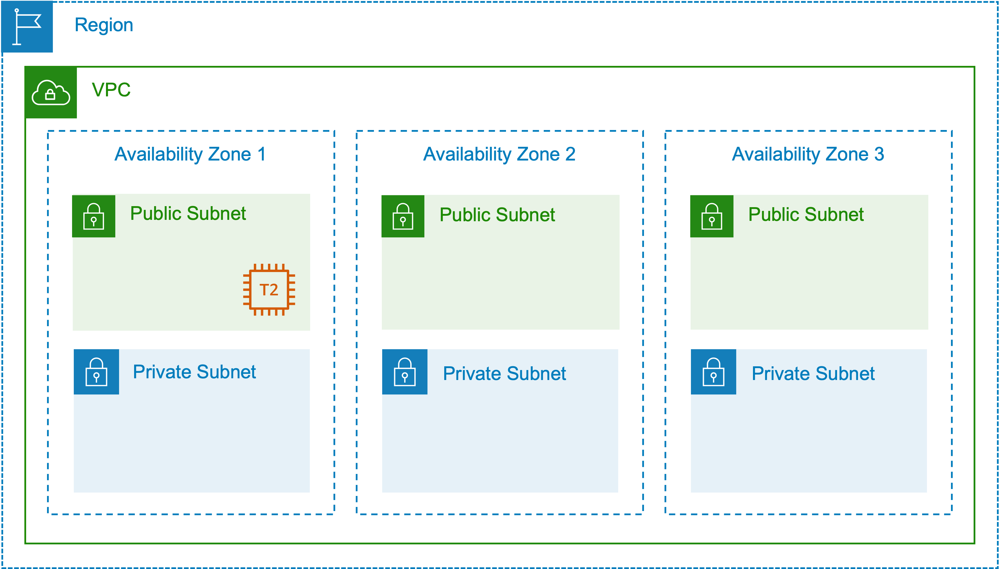
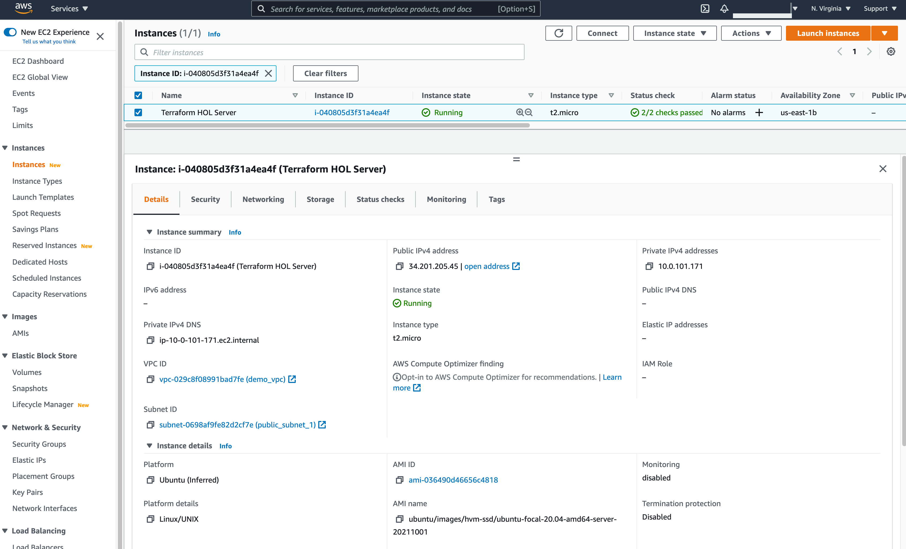

# HarshiCorp Configuration Language (HCL)

- Terraform is written in HCL, it is both machine and human readable.
- HCL is uses Code Configuration blocks, and typically follow the following syntax.

  ```hcl
  <BLOCK_TYPE> "<BLOCK_LABEL>" "<BLOCK_LABEL>" {
    # Block body
    <IDENTIFIER> = <EXPRESSION> # Argument
  }
  ```

  `AWS EC2 Instance` example:

  ```hcl
    resource "aws_instance" "web-server" { #BLOCK
        ami = "ami-0c55b159cbfafe1f0" # Argument
        instance_type = var.instance_type # Argument
    }
  ```

- Here, the `resource` is the block type, `aws_instance` is the block label, and `web-server` is the block label. Also, the instance type isn't fixed and will vary with the environment.

>[!TIP]
>We can have 2 same resources with different block labels, but we can't have 2 resources with the same block label.

- Terraform Code Configuration Block types include:

  - `Settings Block`
  - `Provider Block`
  - `Resource Block`
  - `Data Block`
  - `Module Block`
  - `Input Variable Block`
  - `Output Value Block`
  - `Local Variable Block`



Let's understand this better with an example.

```HCL
provider "aws" {
  access_key = "<YOUR_ACCESSKEY>"
  secret_key = "<YOUR_SECRETKEY>"
  region = "<REGION>"
}
```

- Here, we first have the `Provider Block` for our AWS Instance, `provider` is the block type with, block label `aws`. It has a region argument with the value `us-east-1`.

- However it is not recommended to hardcode the access_key and secret_key in the configuration file, instead we can use environment variables or use the AWS CLI to configure the credentials.

```hcl
#Retrieve the list of AZs in the current AWS region
data "aws_availability_zones" "available" {}
data "aws_region" "current" {}
```

- Here, we have the `Data Block` for the `aws_availability_zones` and `aws_region`. The `aws_availability_zones` block type has the block label `available`, and the `aws_region` block type has the block label `current`.

```hcl
resource "aws_vpc" "vpc" {
  cidr_block = var.vpc_cidr

  tags = {
    Name        = var.vpc_name
    Environment = "demo_environment"
    Terraform   = "true"
  }
}
```

- Here, we have the `Resource Block` for the `aws_vpc`. The `aws_vpc` block type has the block label `vpc`. It has a `cidr_block` argument with the value from the `vpc_cidr` variable.

```hcl
#Deploy the private subnets
resource "aws_subnet" "private_subnets" {
  for_each          = var.private_subnets
  vpc_id            = aws_vpc.vpc.id
  cidr_block        = cidrsubnet(var.vpc_cidr, 8, each.value)
  availability_zone = tolist(data.aws_availability_zones.available.names)[each.value]

  tags = {
    Name      = each.key
    Terraform = "true"
  }
}

#Deploy the public subnets
resource "aws_subnet" "public_subnets" {
  for_each                = var.public_subnets
  vpc_id                  = aws_vpc.vpc.id
  cidr_block              = cidrsubnet(var.vpc_cidr, 8, each.value + 100)
  availability_zone       = tolist(data.aws_availability_zones.available.names)[each.value]
  map_public_ip_on_launch = true

  tags = {
    Name      = each.key
    Terraform = "true"
  }
}

#Create route tables for public and private subnets
resource "aws_route_table" "public_route_table" {
  vpc_id = aws_vpc.vpc.id

  route {
    cidr_block = "0.0.0.0/0"
    gateway_id = aws_internet_gateway.internet_gateway.id
    #nat_gateway_id = aws_nat_gateway.nat_gateway.id
  }
  tags = {
    Name      = "demo_public_rtb"
    Terraform = "true"
  }
}

resource "aws_route_table" "private_route_table" {
  vpc_id = aws_vpc.vpc.id

  route {
    cidr_block = "0.0.0.0/0"
    # gateway_id     = aws_internet_gateway.internet_gateway.id
    nat_gateway_id = aws_nat_gateway.nat_gateway.id
  }
  tags = {
    Name      = "demo_private_rtb"
    Terraform = "true"
  }
}

#Create route table associations
resource "aws_route_table_association" "public" {
  depends_on     = [aws_subnet.public_subnets]
  route_table_id = aws_route_table.public_route_table.id
  for_each       = aws_subnet.public_subnets
  subnet_id      = each.value.id
}

resource "aws_route_table_association" "private" {
  depends_on     = [aws_subnet.private_subnets]
  route_table_id = aws_route_table.private_route_table.id
  for_each       = aws_subnet.private_subnets
  subnet_id      = each.value.id
}

#Create Internet Gateway
resource "aws_internet_gateway" "internet_gateway" {
  vpc_id = aws_vpc.vpc.id
  tags = {
    Name = "demo_igw"
  }
}

#Create EIP for NAT Gateway
resource "aws_eip" "nat_gateway_eip" {
  domain     = "vpc"
  depends_on = [aws_internet_gateway.internet_gateway]
  tags = {
    Name = "demo_igw_eip"
  }
}

#Create NAT Gateway
resource "aws_nat_gateway" "nat_gateway" {
  depends_on    = [aws_subnet.public_subnets]
  allocation_id = aws_eip.nat_gateway_eip.id
  subnet_id     = aws_subnet.public_subnets["public_subnet_1"].id
  tags = {
    Name = "demo_nat_gateway"
  }
}
```

- Here, we have the `Resource Block` for the `aws_subnet`, `aws_route_table`, `aws_route_table_association`, `aws_internet_gateway`, `aws_eip`, and `aws_nat_gateway`.
  
  - The `aws_subnet` block type has the block label `private_subnets` and `public_subnets`.

  - The `aws_route_table` block type has the block label `public_route_table` and `private_route_table`.

  - The `aws_route_table_association` block type has the block label `public` and `private`.

  - The `aws_internet_gateway` block type has the block label `internet_gateway`.

  - The `aws_eip` block type has the block label `nat_gateway_eip`.

  - The `aws_nat_gateway` block type has the block label `nat_gateway`.

- After all this we will add a new resource block for creating another `aws_instance`.

  ```hcl
  resource "aws_instance" "web" {
    ami = "<AMI>"
    instance_type = "t2.micro"
    subnet_id = aws_subnet.public_subnets["public_subnet_1"].id
    vpc_security_group_ids = ["<SECURITY_GROUP>"]
  }

  tags = {
    "Terraform" = "True"
  }
  ```

  