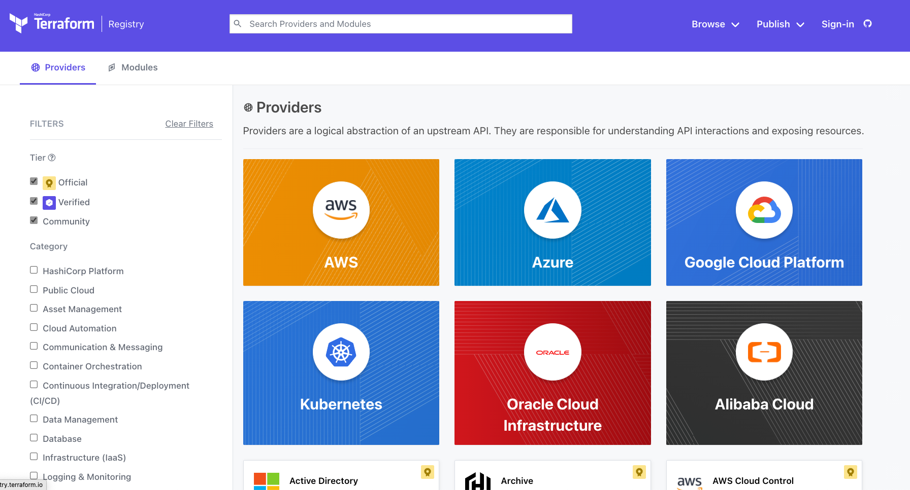

# Terraform Plug-In based Architecture



Terraform relies on plugins called "providers" to interact with remote systems and expand functionality. Terraform configurations must declare which providers they require so that Terraform can install and use them. This is performed within a Terraform configuration block.

The question that might come is how Terraform works with all these differrent systems out there??? Well, it uses these providers or plugins.
So, it has a pluggable architecture which ultimately we can define to terraform how to connect to different remote systems, and how you can actually create, read, write, modify or update any of these resources supported by a given provider.

Let's say we want to install a `AWS Terraform Provider`. We can do this by adding the following code to our configuration file:

```hcl
terraform {
  required_version = ">= 1.0.0" # This is the core version of terraform that we are using.
  required_providers {

    # In this block we mention the providers we are going to use in this configuration.

    aws = {
      source  = "hashicorp/aws"
      version = "~> 3.0"
    }
  }
}
```

Once, dne go ahead and run the `terraform init` command. This will initalize and download the required providers.

To verify if these providers are properly installed you can use the command `terraform version`.

There's another command `terraform providers` that tells you about the providers required by our configuration. This pluggable architecture allows us to really expand our terraform configuration to meet many use cases.

We can have one to many providers referenced byt our terraform configuration. This makes our IaC very scalable.

# Using the Terraform Provider Block

- 
